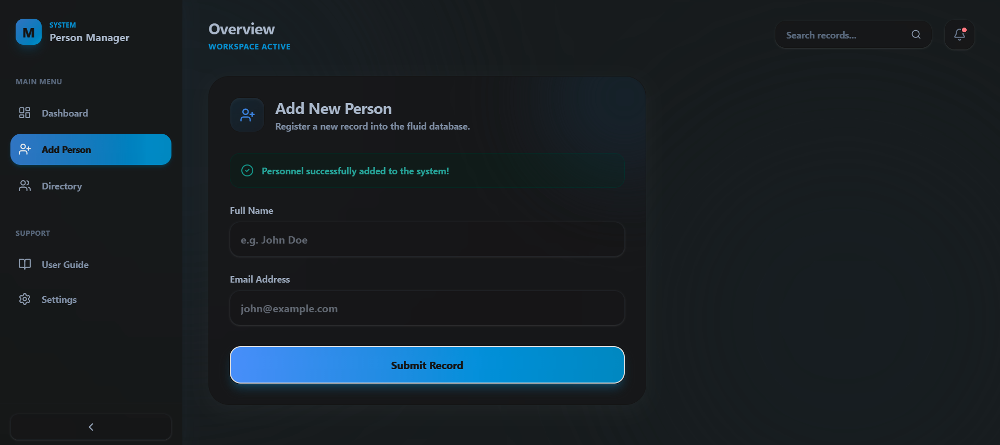
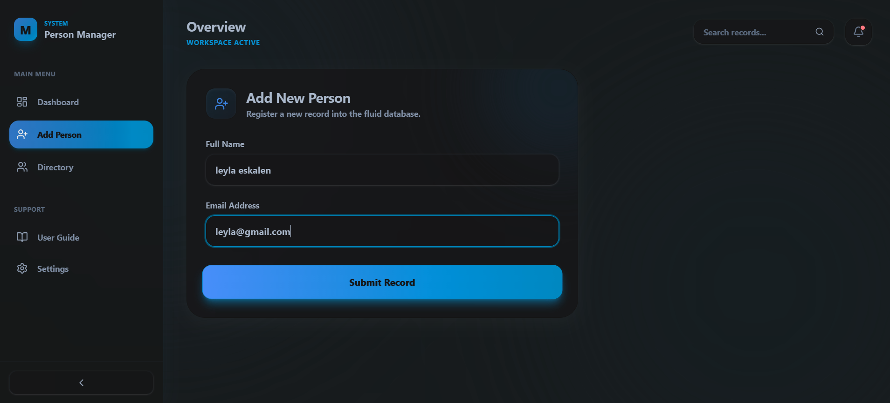
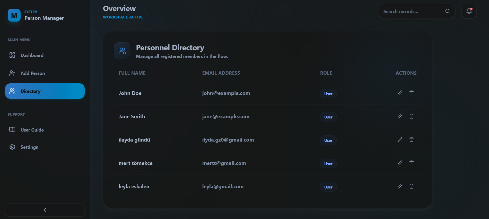
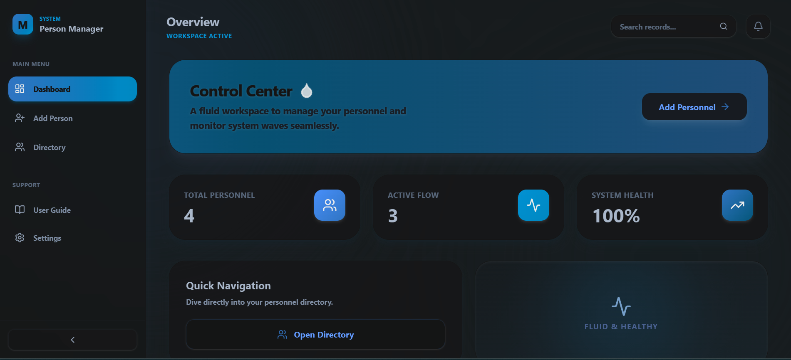
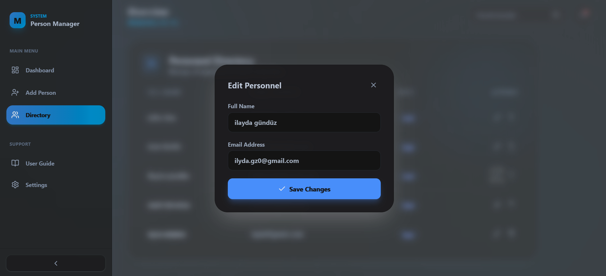
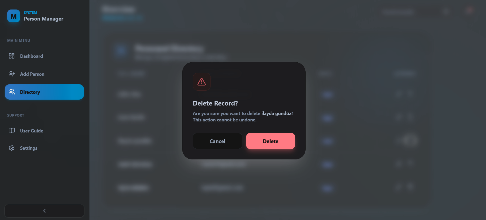
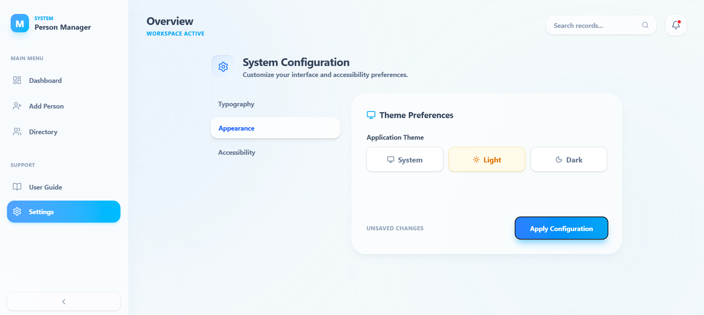
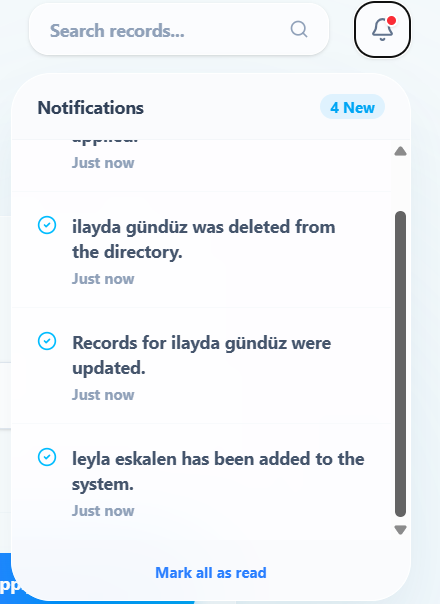
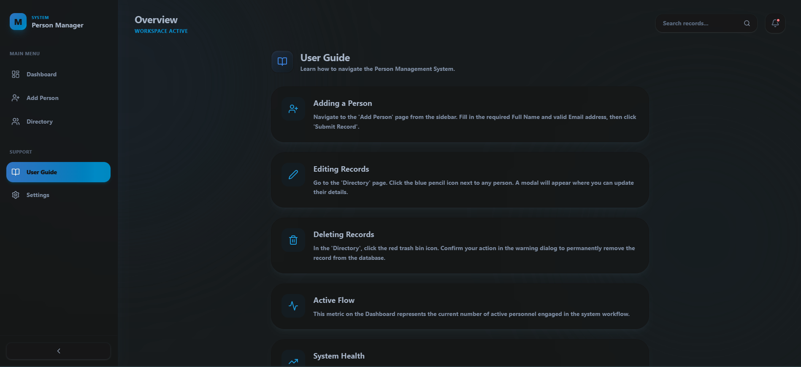

# Person Management System

## Project Description
This is a robust, full-stack web application designed for seamless personnel management. The system is built with a modern React frontend featuring a fluid, glassmorphism-inspired UI, powered by a Node.js/Express backend, and utilizes PostgreSQL for persistent data storage. 

The entire application is fully containerized using Docker and Docker Compose, ensuring a frictionless, "one-click" deployment environment across all operating systems.

### ✨ Premium Features & Enhancements
Beyond the core CRUD operations, this project includes several advanced UI/UX features:
* **Fluid Animations:** Smooth, water-drop inspired transitions and micro-interactions using `framer-motion`.
* **Global Search:** A real-time search bar that instantly filters the personnel directory from anywhere in the app.
* **Notification System:** A dynamic bell icon that logs real-time updates (creations, deletions, updates) into a dropdown menu.
* **System Configuration:** A fully functional Settings module allowing users to toggle **Dark Mode**, adjust global **Font Sizes**, and enable accessibility features like **Reduce Motion** and **High Contrast**.
* **State Persistence:** User preferences and notifications are saved in the browser's Local Storage, surviving page refreshes.

## Technologies Used
* **Frontend:** React (Vite), Tailwind CSS, Framer Motion, Lucide React
* **Backend:** Node.js, Express.js
* **Database:** PostgreSQL
* **Infrastructure:** Docker, Docker Compose

## Setup and Run Instructions

### Prerequisites
* Docker and Docker Desktop installed and running.
* Git installed on your local machine.

### Installation & Execution
1. Clone the repository:
   ```bash
   git clone https://github.com/ilydagz/SENG384-Individual.git
   cd SENG384-Individual 
   ```
2. Start the application:
   ```bash
   docker compose up --build
   ```
3. Access the application:
   ```bash
   - Frontend: http://localhost:5173
   - Backend API: http://localhost:5001
   - Database: http://localhost:5432        
   ```
4. Stop the application:
   ```bash
   docker compose down
   ```   
## API Endpoint Documentation

Base URL: `http://localhost:5001/api`

| HTTP Method | Endpoint | CRUD Operation | Description | HTTP Status Codes |
| :--- | :--- | :--- | :--- | :--- |
| **POST** | `/people` | **Create** | Creates a new personnel record in the database. | 201 (Created), 400 (Bad Request), 409 (Conflict) |
| **GET** | `/people` | **Read** | Retrieves a list of all personnel records. | 200 (OK), 500 (Server Error) |
| **GET** | `/people/:id` | **Read** | Retrieves a single personnel record by its ID. | 200 (OK), 404 (Not Found) |
| **PUT** | `/people/:id` | **Update** | Updates the details of an existing personnel record. | 200 (OK), 400 (Bad Request), 404 (Not Found) |
| **DELETE** | `/people/:id` | **Delete** | Removes a personnel record from the database. | 200 (OK), 404 (Not Found) |

1. Registration(Create) Form Page

2. List(Read) Page


3. Dashboard

4. Edit(Update) Page

5. Delete Page

6. Settings

7. Notifications

8. User Guide
 
